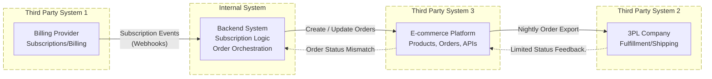

 ***Challenges with existing system***
 * Current subscription logic is managed by third party. Potential issues with timing and duplications
 * Source of truth. Who manages our product? The properties we have control over might not be able to flow into the third party system
 * Too many connections to manager. E-Commerce is being used as the source of truth for 3PL. Might have constraints how much data can go into it and what properties
 * Debugging problems. What happens when one of these connections fail or the events flow is disturbed. Would be hard to integrate observability of the whole system
 * Too many chained events. Each system talks to the next and information/event might get lost/fail along the way
 * No single source of truth
 * Engineering is constantly chasing syncing issues. Too many teams will might have to get involved to get the failed events out.
 * New features might be hard to integrate based on the feature. Perhaps because third party system cant accomodate it.
 * Potential scaling challenges
 * Customer issues -> custumer support bottlenecks. What happens when complaints arrive
 * Team burnout

