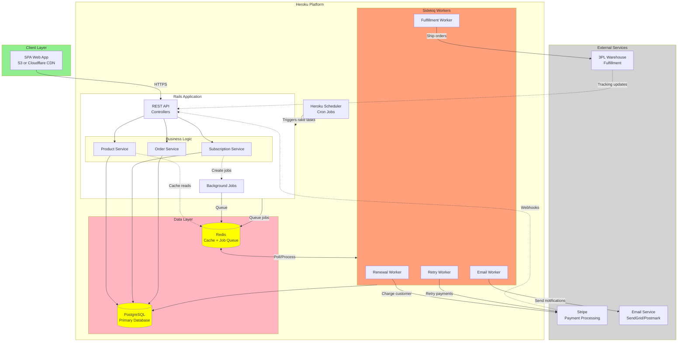

```mermaid
graph TB
    %% Frontend
    subgraph CLIENT["Client Layer"]
        SPA[SPA Web App<br/>S3 or Cloudflare CDN]
    end
    
    subgraph HEROKU["Heroku Platform"]
        
        SCHEDULER[Heroku Scheduler<br/>Cron Jobs]
        
        subgraph RAILS["Rails Application"]
            API[REST API<br/>Controllers]
            
            subgraph SERVICES["Business Logic"]
                PRODUCTS[Product Service]
                SUBS[Subscription Service]
                ORDERS[Order Service]
            end
            
            JOBS[Background Jobs]
        end
        
        subgraph WORKERS["Sidekiq Workers"]
            W1[Renewal Worker]
            W2[Retry Worker]
            W3[Email Worker]
            W4[Fulfillment Worker]
        end
        
        subgraph DATA["Data Layer"]
            POSTGRES[(PostgreSQL<br/>Primary Database)]
            REDIS[(Redis<br/>Cache + Job Queue)]
        end
    end
    
    subgraph EXTERNAL["External Services"]
        STRIPE[Stripe<br/>Payment Processing]
        WAREHOUSE[3PL Warehouse<br/>Fulfillment]
        EMAIL[Email Service<br/>SendGrid/Postmark]
    end
    
    SPA -->|HTTPS| API
    
    API --> PRODUCTS
    API --> SUBS
    API --> ORDERS
    
    PRODUCTS --> POSTGRES
    SUBS --> POSTGRES
    ORDERS --> POSTGRES
    
    PRODUCTS -.->|Cache reads| REDIS
    
    SCHEDULER -->|Triggers rake tasks| RAILS
    RAILS -->|Queue jobs| REDIS
    
    REDIS <-->|Poll/Process| WORKERS
    WORKERS --> POSTGRES
    
    W1 -->|Charge customer| STRIPE
    W2 -->|Retry payments| STRIPE
    W3 -->|Send notifications| EMAIL
    W4 -->|Ship orders| WAREHOUSE
    
    STRIPE -.->|Webhooks| API
    
    WAREHOUSE -.->|Tracking updates| API
    
    SUBS -.->|Create jobs| JOBS
    JOBS -->|Queue| REDIS
    
    %% Styling
    style CLIENT fill:lightgreen
    style HEROKU fill:lightpurple
    style RAILS fill:white
    style WORKERS fill:lightsalmon
    style DATA fill:lightpink
    style EXTERNAL fill:lightgray
    style REDIS fill:yellow
    style POSTGRES fill:yellow
```    